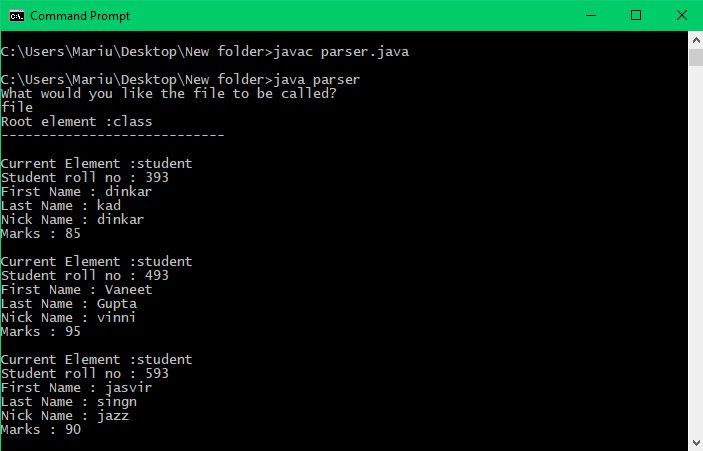
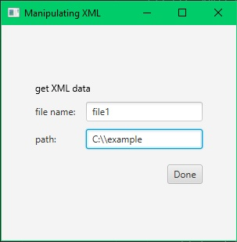

# JavaParsingMethods

The DOM method for parsing XML data, can be run with cmd prompt (image below)
I will describe it in 3 simple steps: 
1.user is asked for file name 
2.filename with .txt type will be generated 
3.output from XML source will be generated in the txt file 

  
 
 
### The GUI method (work in progress)
 
